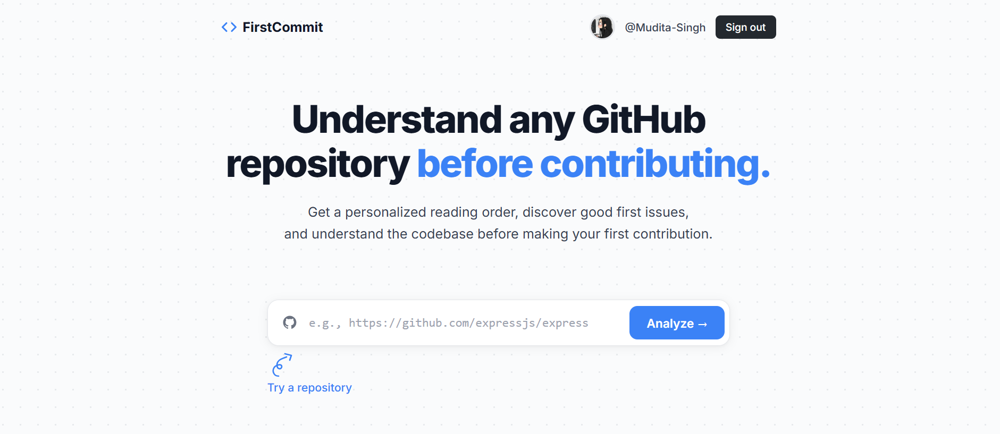

  

<h3 align="center">
B.Tech CSE (Cyber Security & Forensics) • UPES Dehradun
</h3>

## 🚀 About Me

- 🔐 Passionate about **Cybersecurity and Development**
- 💻 Regularly solving **Data Structures & Algorithms** problems
- 🚀 Building real-world projects with **Java, React, Node.js, Express, and MongoDB**
  
---

## 🏆 Open Source

- 🌟 **GirlScript Summer of Code 2026 (GSSoC'26) Contributor**
- ✅ **15+ Pull Requests merged** across multiple open-source repositories
  
---

## 📊 GitHub Stats

  
  

## 🧩 LeetCode

  

---
## 💻 Tech Stack

### Languages

   
  Java • JavaScript • Python

### Frontend

   
  React • HTML5 • CSS3

### Backend

   
  Node.js • Express.js

### Database

   
  MySQL • MongoDB

### Tools

   
  Git • VS Code • Linux

---
---
## 🚀 Featured Projects
### ✨ FirstCommit

AI-powered platform designed to help first-time contributors understand and contribute to open-source repositories.

  

  

**Key Features**

- 🤖 AI-powered repository analysis and code explanations using **Google Gemini**
- 🔎 RAG-based semantic code search using **Pinecone**
- 📚 Generates an optimized **file reading order** for unfamiliar codebases
- 🐛 AI Issue Explorer for discovering beginner-friendly GitHub issues
- 💬 Repository Q&A for asking questions about the codebase
- 🔐 GitHub OAuth authentication
- ⚡ Built with **React, Node.js, Express, MongoDB, Gemini AI, and Pinecone**
- ☁️ Deployed using **Vercel and Render**

🔗 **[Repository](https://github.com/Mudita-Singh/FirstCommit)**

---

## 📈 GitHub Activity

---

## 📫 Connect With Me

  

  

  

  

---

⭐ <b>Always learning, building, and improving!</b>

